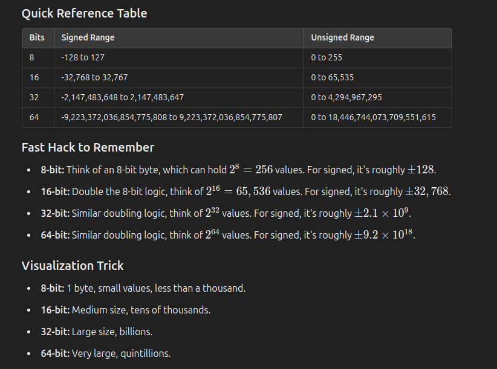

In laymen's terms an unsigned int is an integer that can not be negative and thus has a higher range of positive values that it can assume. A signed int is an integer that can be negative but has a lower positive range in exchange for more negative values it can assume.

### Refer to this:

